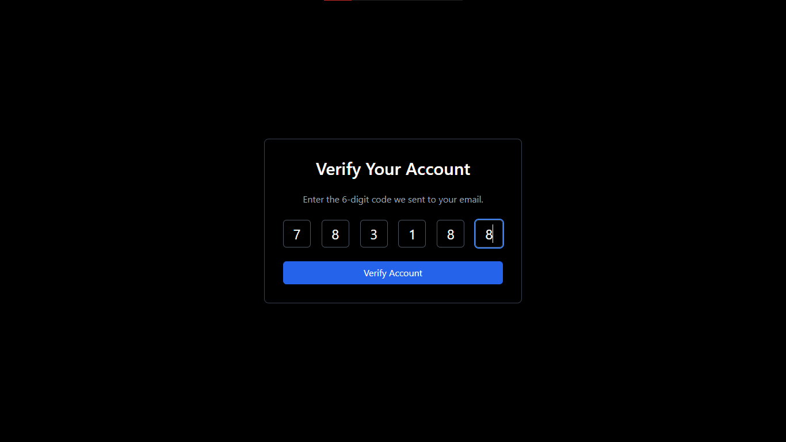

# MERN Authentication Project 🔒

A full-featured authentication system built using the MERN stack (MongoDB, Express, React, Node.js) with additional tools like JWT for token-based authentication, Resend for email verification, Zustand for state management, and Tailwind CSS for styling.

## Features

- **User Authentication**: Sign-up, sign-in, and logout functionality.
- **Account Verification**: Users receive an email with a verification code using **Resend**. Accounts must be verified before accessing protected routes.
- **JWT Authentication**: JSON Web Tokens ensure secure and stateless authentication.
- **Responsive UI**: The front-end is built with **Vite**, **React**, and **Tailwind CSS** for a fast and responsive design.
- **State Management**: **Zustand** handles global state management across the app.
- **Icons**: Integrated icons enhance the user-friendly interface.

## Tech Stack

### Frontend:
- **React (Vite)** for fast development.
- **Tailwind CSS** for sleek, responsive styling.
- **Zustand** for managing global state.
- **React Router** for routing between pages.

### Backend:
- **Node.js & Express** for the server-side.
- **MongoDB** for database storage.
- **JWT** for secure, token-based authentication.
- **Resend** for sending account verification emails.

## Screenshots


*Sign-up page with fields for username, email, and password.*


*Verification page where users enter a 6-digit verification code.*

## Installation & Setup

### Prerequisites

Ensure you have the following installed:

- [Node.js](https://nodejs.org/en/)

### Clone the Repository

```bash
git clone https://github.com/Ali-Raza764/mern-auth
cd mern-auth
npm install
cd client
npm install
```

### Starting the Application

1. **Server**: Run the server with:
   ```bash
   npm run dev
   ```
2. **Client**: Start the client app with:
   ```bash
   cd client
   npm run dev
   ```

## Contributing

This project is open source and contributions are welcome! If you want to contribute, feel free to open a pull request.